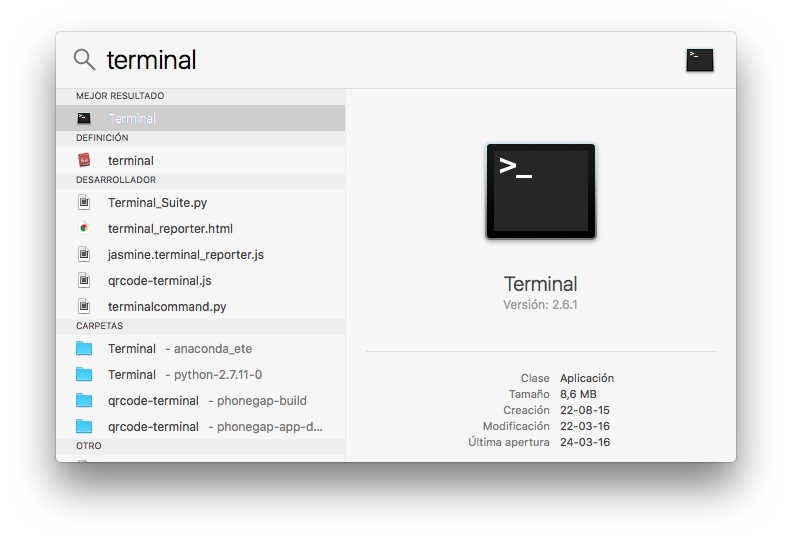
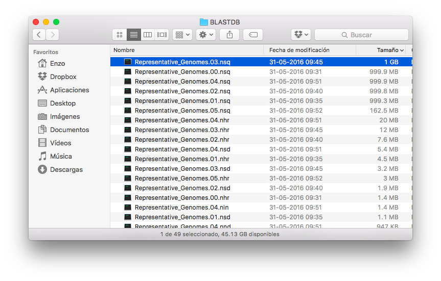
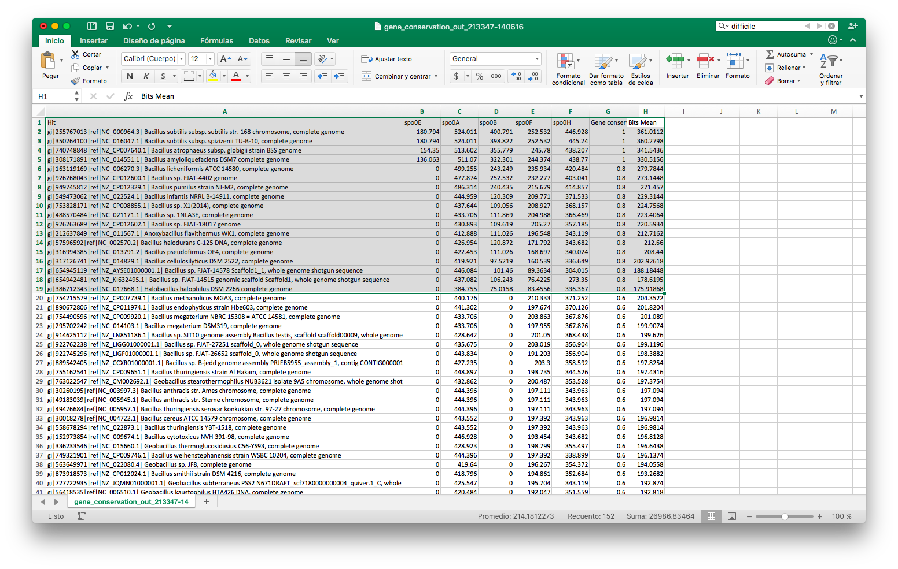

# GeCo (Gene Conservation) a platform for finding gene conservation along the RefSeq genomes of NCBI

GeCo (Gene Conservation) is a platform developed on python3 for finding gene conservation along the RefSeq genomes of NCBI.

There is two ways to run the script depending if you have or not an output file in xml of BLAST against Representative bacterial/archaeal genomes database of NCBI ftp://ftp.ncbi.nlm.nih.gov/blast/db/Representative_Genomes.*.tar.gz

1) If you have the output file of BLAST on xml format (from web service or locally) you have to run the script like this.

    python3 GeCo.py -g BLAST_OUTPUT.xml -b 75

Where the flag "-b" is the threshold bit score for considerate a hit as a truly homologous.

The output of GeCo is a raw tab-separated file and a matrix for a better analisis, and it contain Query, Hit and Bits data from BLAST file.

gene\_conservation\_out.tsv contain a matrix with all hits as rows and all genes used as query, aditionaly this file has 2 columns more 'Gene conservation' and 'Bits Mean', that is the proportion of gene conservation for a single organism (Hit) and the mean of Bit score of all queries of this organism.

2) If you do not have the output file of BLAST on xml format you must run BLAST, personally i recommend run BLAST like this:

    tblastn -query FASTA_AA.faa -db ~/BLASTDB/Representative_Genomes\
    -db_gencode 11 -matrix BLOSUM45 -num_threads 4  -evalue 0.001\
    -max_target_seqs 1000000 -max_hsps 1 -qcov_hsp_perc 75 -outfmt 5\
    -out tblastn_out.xml

Then you have the input file for GeCo, so go to step 1

2.a) Alternatively, GeCo can make a BLAST locally for you (but is better make the BLAST by yourself on terminal)

    python3 GeCo.py -blast FASTA_AA.faa -db ~/BLASTDB/Representative_Genomes\
    -o tblastn_out.xml

Once you have the "tblastn_out.xml" you must to go to step 1

Run `python3 GeCo.py -h` for more help.

## Tutorial
#### One run takes 15 minutes in a MacBook Air 1,3 GHz Intel Core i5 4 GB 1600 MHz DDR3 and need ≈6 Gb in your hard drive if you want run BLAST locally (recomended)

This demo relies on two pieces of software, *Python3*, *BLAST+*, additionally you need to install python modules (*Pandas*, *BioPython*, *Numpy*) so please remember to cite them if you end up publishing results obtained with these tools.

### Installing the package manager brew

You must open the terminal, the easy way is pressing **CMD ⌘ + SPACEBAR** and type "terminal" and click on it, or press Intro:

Next in the terminal type this:

	/usr/bin/ruby -e "$(curl -fsSL https://raw.githubusercontent.com/Homebrew/install/master/install)"
	brew doctor
	brew update
	brew install git
	brew install wget
	sudo cpan Time::Piece XML::Simple Bio::Perl
	brew install python3
	brew install blast
	pip3 install pandas
	pip3 install numpy
	pip3 install biopython

#### By careful in this tutorial with the version downloaded, if it is diferent, you must change the comandlines.

### Obtaining data

For run BLAST locally you have to download the database from NCBI, type this on your terminal

	wget ftp://ftp.ncbi.nlm.nih.gov/blast/db/Representative_Genomes.*.tar.gz

And decompress files and save on your HOME DIR by example (≈5Gb)

### Clasical run

In this tutorial we going to search genes related with the sporulation in *Bacillus subtilis* (Spo0A, Spo0E, Spo0B, Spo0H, Spo0F):
	
	>Spo0E
	MGGSSEQERLLVSIDEKRKLMIDAARKQGFTGHDTIRHSQELDCLINEYHQLMQENEHSQ
	GIQGLVKKLGLWPRRDVMPAYDANK
	>Spo0A
	MEKIKVCVADDNRELVSLLSEYIEGQEDMEVIGVAYNGQECLSLFKEKDPDVLVLDIIMP
	HLDGLAVLERLRESDLKKQPNVIMLTAFGQEDVTKKAVDLGASYFILKPFDMENLVGHIR
	QVSGNASSVTHRAPSSQSSIIRSSQPEPKKKNLDASITSIIHEIGVPAHIKGYLYLREAI
	SMVYNDIELLGSITKVLYPDIAKKFNTTASRVERAIRHAIEVAWSRGNIDSISSLFGYTV
	SMTKAKPTNSEFIAMVADKLRLEHKAS
	>Spo0B
	MKDVSKNQEENISDTALTNELIHLLGHSRHDWMNKLQLIKGNLSLQKYDRVFEMIEEMVI
	DAKHESKLSNLKTPHLAFDFLTFNWKTHYMTLEYEVLGEIKDLSAYDQKLAKLMRKLFHL
	FDQAVSRESENHLTVSLQTDHPDRQLILYLDFHGAFADPSAFDDIRQNGYEDVDIMRFEI
	TSHECLIEIGLD
	>Spo0H
	MNLQNNKGKFNKEQFCQLEDEQVIEKVHVGDSDALDYLITKYRNFVRAKARSYFLIGADR
	EDIVQEGMIGLYKSIRDFKEDKLTSFKAFAELCITRQIITAIKTATRQKHIPLNSYASLD
	KPIFDEESDRTLLDVISGAKTLNPEEMIINQEEFDDIEMKMGELLSDLERKVLVLYLDGR
	SYQEISDELNRHVKSIDNALQRVKRKLEKYLEIREISL
	>Spo0F
	MMNEKILIVDDQYGIRILLNEVFNKEGYQTFQAANGLQALDIVTKERPDLVLLDMKIPGM
	DGIEILKRMKVIDENIRVIIMTAYGELDMIQESKELGALTHFAKPFDIDEIRDAVKKYLP
	LKSN

Save this FASTA in your Mac as name spo.faa

Now we need to get the blast xml output, so in the terminal type:
	
	tblastn -query spo.faa -db ~/BLASTDB/Representative_Genomes\
        -db_gencode 11 -matrix BLOSUM45 -num_threads 4  -evalue 0.001\
        -max_target_seqs 1000000 -max_hsps 1 -qcov_hsp_perc 75 -outfmt 5\
        -out tblastn_spo.xml

#### Be carefull with the flag '-db' you have to change the folder were is the database downloaded

Now it's time for GeCo magic, type:

	python3 GeCo.py -g tblastn_spo.xml

And you get
	
	GeCo DONE [gene_conservation_out_213347-140616.tsv file was created on this folder]

Now open and see.

Resalted is the genomes with more than 80% of conservation for 5 Queries.

## Citation

Altschul SF1, Gish W, Miller W, Myers EW, Lipman DJ.	
*Basic local alignment search tool*  
**Journal of molecular biology** 1990 Oct 5;215(3):403-10.	
[PMID: 2231712](http://www.ncbi.nlm.nih.gov/pubmed/2231712)